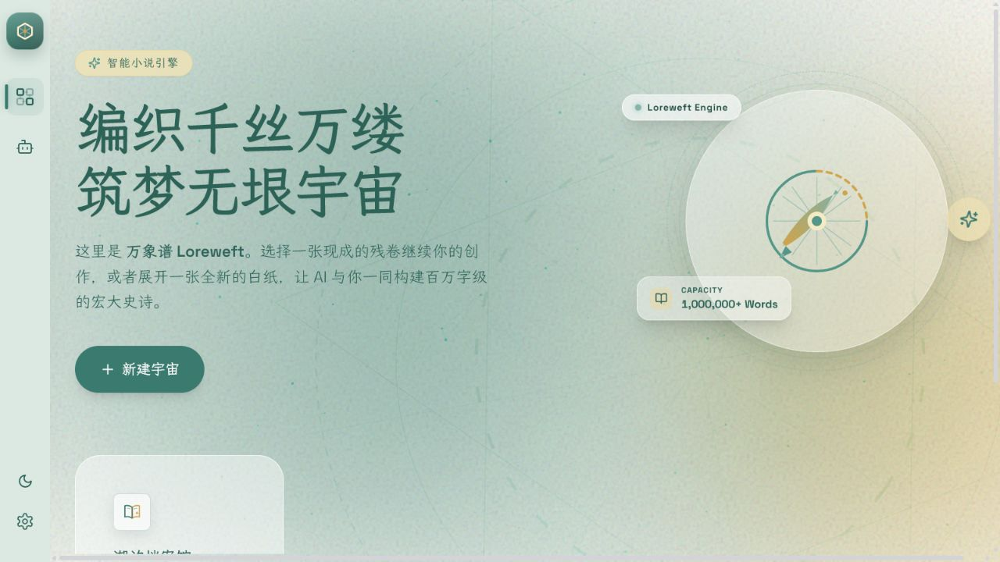
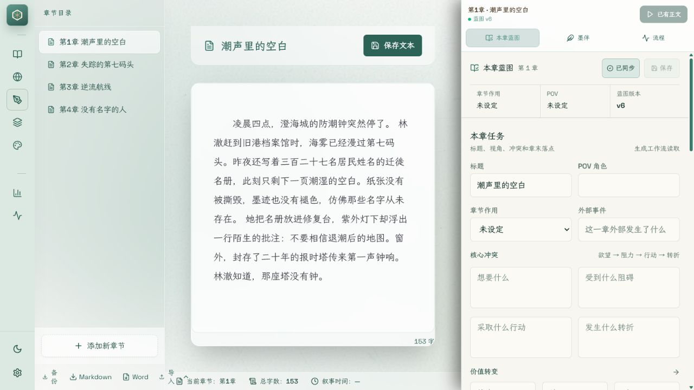
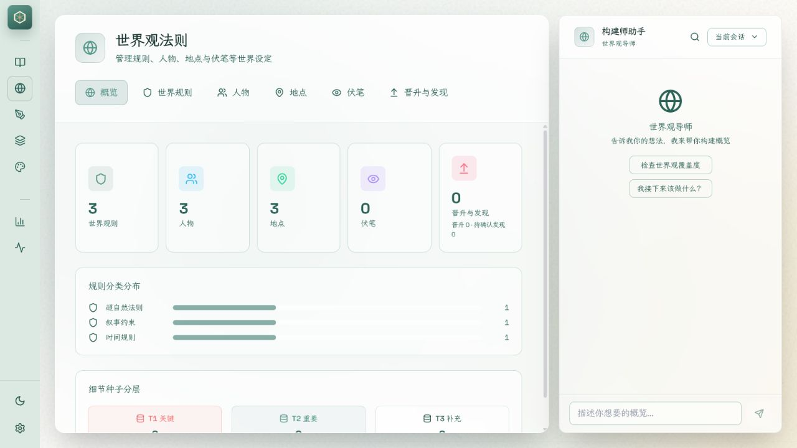
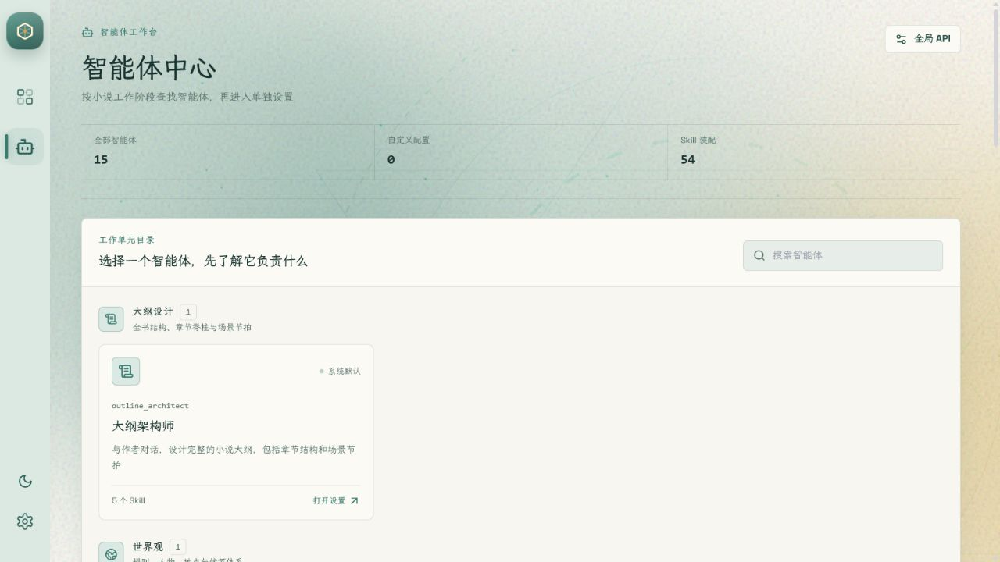
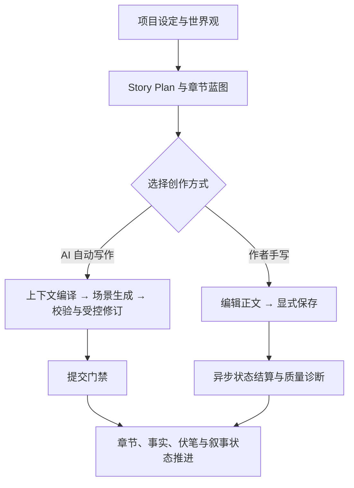

<p align="center">
  
</p>

<h1 align="center">万象谱 Loreweft</h1>

<p align="center">
  面向长篇小说工程的 AI 原生创作工作台<br />
  <em>AI-native workspace for long-form fiction</em>
</p>

<p align="center">
  <code>Windows 10 / 11</code> · <code>Local-first</code> · <code>Public Beta</code> · <code>Closed Source</code>
</p>

<p align="center">
  <a href="https://github.com/EXwhitewood/wanxiangpu-loreweft/releases/latest">下载最新版</a>
  ·
  <a href="CHANGELOG.md">版本记录</a>
  ·
  <a href="https://github.com/EXwhitewood/wanxiangpu-loreweft/issues">问题反馈</a>
</p>



<p align="center"><sub>“潮汐档案馆”为界面展示使用的虚构示例项目。</sub></p>

## 项目简介

万象谱不是一个只负责“根据提示词续写”的聊天界面，而是一套围绕长篇小说全生命周期设计的本地创作工作台。它把项目定位、世界观、人物与地点、结构大纲、章节蓝图、正文、伏笔、叙事状态、质量诊断和生成轨迹放在同一个工程中，让 AI 每次工作时都能读取明确的创作约束，也让作者始终保留对正文和设定的最终决定权。

长篇创作真正困难的地方，往往不是生成某一段文字，而是让几十万字里的事实、人物关系、叙事时间、伏笔和风格长期保持一致。万象谱针对这些问题提供结构化支持：

- 用 Story Plan 和章节蓝图连接“全书构想”与“当前这一章”；
- 用世界规则、人物、地点、伏笔和状态账本保存可持续演进的小说事实；
- 用多阶段生成、校验、受控修订和提交门禁降低前后矛盾与失控改写；
- 同时支持 AI 自动写作与作者手写，两条路径共享状态但互不越权；
- 将项目数据保存在本地，模型调用只在用户主动使用相应 AI 功能时发生。

## 当前状态

| 项目 | 当前状态 |
| --- | --- |
| 版本 | `0.3.3 Beta` |
| 发布目标 | Windows 10 / 11（x64） |
| 桌面形态 | 独立桌面应用，安装包内置运行所需组件 |
| 数据策略 | 本地优先；创作项目与设置默认保存在本机 |
| AI 服务 | 用户自行配置兼容的模型服务 |
| 更新方式 | 通过本仓库 GitHub Releases 检查并签名验证 |
| 源码状态 | 闭源；本仓库只用于产品说明、反馈和发行 |

当前版本仍处于快速迭代阶段，界面、工作流和数据结构可能继续调整。重要项目在升级或迁移前，请先使用项目归档功能创建备份。

## 核心能力

| 模块 | 能力 | 解决的问题 |
| --- | --- | --- |
| 项目工作台 | 项目简介、目标字数、章节进度、最近编辑与功能入口 | 让一部长篇作品拥有清晰的工程主页 |
| 结构大纲 | Story Plan、章节脊柱、故事线、章节蓝图和场景序列 | 把宏观构想拆成可以执行和检查的章节任务 |
| 世界观系统 | 世界规则、人物、地点、伏笔、细节种子与设定晋升 | 减少设定散落、遗忘和相互冲突 |
| 沉浸创作 | 正文编辑器、章节目录、蓝图面板、墨伴与流程监控 | 在同一界面完成手写、讨论、生成和审阅 |
| AI 生成工作流 | 上下文编译、场景生成、并行校验、受控修订、提交门禁 | 让生成过程可分阶段观察，而不是一次性黑盒输出 |
| 状态与连续性 | 叙事时间、人物状态、事实命题、任务进度和章节派生状态 | 让后续章节能够继承已经发生的变化 |
| 质量系统 | 一致性提醒、章节诊断、场景校验、修订候选和项目健康检查 | 将问题暴露给作者，并保留最终决定权 |
| 智能体与 Skill | 按大纲、世界观、写作、推演、文笔和审校划分职责 | 让不同创作任务使用清晰的角色与约束 |
| 导入、导出与归档 | Markdown、Word、项目归档与恢复 | 区分阅读导出和可恢复的完整项目备份 |

部分增强能力需要用户自行配置兼容的模型 API。没有配置模型时，项目管理、正文编辑、世界观维护、导入导出等本地功能仍可使用。

## 界面预览

### 项目仪表盘

项目仪表盘汇总作品简介、目标字数、章节进度和最近编辑，并提供结构大纲、沉浸创作、世界法则、市场情报与健康诊断等入口。


### 沉浸创作与章节蓝图

编辑器将章节目录、正文纸张和 AI 协作区并列呈现。作者可以直接手写与保存正文，也可以为当前章节维护目标、冲突、转折、章末钩子和场景序列，再把明确的蓝图交给生成工作流。



### 世界观工作台

世界观工作台统一管理世界规则、人物、地点、伏笔和从正文中提取的候选发现。发现与晋升流程会区分待确认、自动确认和人工确认，方便作者追踪设定从正文证据进入核心世界观的过程。



### 智能体中心

智能体中心按照大纲设计、世界观、正文创作、剧情推演、文笔系统、质量审校和智能修订划分职责，并展示每个智能体承担的能力与独立配置。



## 两种写作方式

万象谱将 AI 自动写作与作者手写视为两条并列路径，而不是让 AI 接管编辑器。



### AI 自动写作

系统从大纲和章节蓝图编译本章上下文，按场景生成正文，执行一致性、合同与读者体验检查，只在受理范围内生成修订候选，并在提交门禁通过后写入正式章节与派生状态。已有用户正文不会被普通生成流程静默覆盖。

### 作者辅助写作

作者可以完全手写正文。显式保存时，正文先被安全保存，摘要、世界观观察、叙事状态、进度和诊断在后台分阶段结算。附属分析失败不会阻止正文保存，也不会擅自改写作者文本。

## 本地运行方式

```text
Windows 桌面应用
  ├─ 创作界面与正文编辑器
  ├─ 仅在本机运行的应用服务
  ├─ 本地项目数据与设置
  └─ 用户选择的模型 API（仅在调用相应 AI 功能时访问）
```

创作状态默认保存在本机，桌面应用负责管理本地服务的启动与退出。阅读导出用于分享或排版，项目归档才是包含完整工程信息的备份与恢复格式。


## 下载、安装与自动更新

请只从本仓库的 [Releases](https://github.com/EXwhitewood/wanxiangpu-loreweft/releases) 下载官方 Windows 安装包。安装包已经包含运行所需组件，不需要另行安装 Python、Node.js 或 Rust。

应用通过本仓库的 GitHub Releases 检查更新。每个更新包都必须通过应用内置公钥的签名验证；发布清单、安装包和签名文件会作为同一 Release 的资产提供。

当前版本仍是 Public Beta，Windows 安装包尚未使用 Authenticode 代码签名，安装时可能显示“未知发布者”或触发 SmartScreen。升级或迁移前，请先使用应用内项目归档功能备份重要作品。

## 数据与联网说明

- 项目、章节、设定、诊断和设置默认保存在本地应用数据目录；
- 当前公开版本不会向万象谱维护者发送产品分析遥测；
- 只有在用户主动调用模型功能时，必要的提示词、上下文和作品片段才可能发送给用户选择的模型服务商；
- 更新检查会访问 GitHub Releases，并可能使用用户当前的系统代理；
- 请勿在公开 Issue 中提交 API Key、数据库、项目归档或未公开作品全文。

详情见 [隐私说明](PRIVACY.md) 与 [安全政策](SECURITY.md)。

## 用户作品权利

用户保留其输入内容和原创作品的权利，可以出版、签约、销售、授权、翻译、改编或以其他方式商业使用作品。万象谱不会仅因软件参与创作、编辑、诊断或保存而主张作品所有权、版税或收入分成。

详情见 [用户作品权利说明](OUTPUT_RIGHTS.md)。

## 仓库范围与版权

这是万象谱的公开产品、支持与发行仓库，用于发布产品说明、版本记录、Issue 和经过签名的安装包。仓库不提供核心源码、内部构建系统或源码构建支持，也不接收代码 Pull Request。

本仓库不是开源源码仓库。除明确标注适用独立许可证的第三方材料外，仓库内容与万象谱官方程序 Copyright © 2026 EXwhitewood，保留所有权利。第三方组件归属见 [THIRD_PARTY_NOTICES.md](THIRD_PARTY_NOTICES.md)。

## 反馈

错误报告和功能建议请提交到 [GitHub Issues](https://github.com/EXwhitewood/wanxiangpu-loreweft/issues)。提交前请阅读 [贡献与反馈说明](CONTRIBUTING.md)；安全漏洞请按照 [SECURITY.md](SECURITY.md) 使用私密渠道报告。
