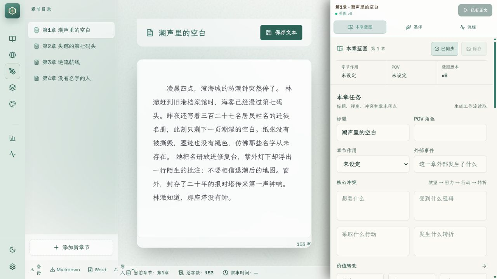
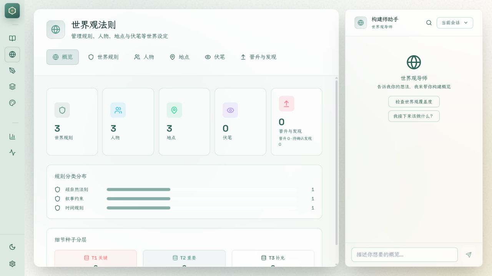
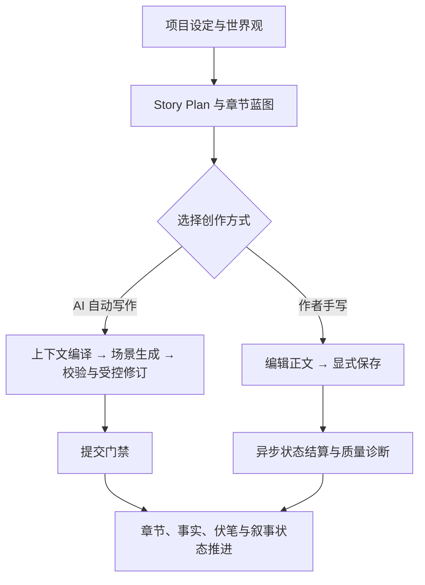

<p align="center">
  
</p>

<h1 align="center">万象谱 Loreweft</h1>

<p align="center">
  面向长篇小说工程的 AI 原生创作引擎<br />
  <em>AI-native workspace for long-form fiction</em>
</p>

<p align="center">
  <code>v0.3.5 Beta</code> · <code>Windows 10 / 11</code> · <code>Local-first</code> · <code>AGPL-3.0</code>
</p>


<p align="center"><sub>万象谱项目大厅。下方预览中的“潮汐档案馆”是专用于界面展示的虚构示例项目。</sub></p>

## 项目简介

万象谱不是一个只负责“根据提示词续写”的聊天界面，而是一套围绕长篇小说全生命周期设计的本地创作工作台。它把项目定位、世界观、人物与地点、结构大纲、章节蓝图、正文、伏笔、叙事状态、质量诊断和生成轨迹放在同一个工程中，让 AI 每次工作时都能读取明确的创作约束，也让作者始终保留对正文和设定的最终决定权。

长篇创作真正困难的地方，往往不是生成某一段文字，而是让几十万字里的事实、人物关系、叙事时间、伏笔和风格长期保持一致。万象谱针对这些问题提供结构化支持：

- 用 Story Plan 和章节蓝图连接“全书构想”与“当前这一章”；
- 用世界规则、人物、地点、伏笔和状态账本保存可持续演进的小说事实；
- 用多阶段生成、校验、受控修订和提交门禁降低前后矛盾与失控改写；
- 同时支持 AI 自动写作与作者手写，两条路径共享状态但互不越权；
- 将项目数据保存在本地 SQLite 与本地创作目录中，模型调用只在用户主动使用相应 AI 功能时发生。

## 当前状态

| 项目 | 当前状态 |
| --- | --- |
| 版本 | `0.3.5 Beta` |
| 发布目标 | Windows 10 / 11 |
| 桌面运行时 | Tauri 2，安装包内置前端、后端与 Python 3.12 运行时 |
| 前端 | React 18、TypeScript、Vite、Zustand、Tiptap |
| 后端 | FastAPI、SQLAlchemy、SQLite |
| 数据策略 | 本地优先；SQLite 是创作状态的权威持久层 |
| 开源许可 | 自有代码采用 `AGPL-3.0-only`；第三方组件继续适用各自许可证 |

当前版本仍处于快速迭代阶段，界面、工作流和数据结构可能继续调整。重要项目在升级、迁移或修改源码前，请先使用项目归档功能创建备份。

## 核心能力

| 模块 | 能力 | 解决的问题 |
| --- | --- | --- |
| 项目工作台 | 项目简介、目标字数、章节进度、最近编辑与功能入口 | 让一部长篇作品拥有清晰的工程主页 |
| 结构大纲 | Story Plan、章节脊柱、故事线、章节蓝图和场景序列 | 把宏观构想拆成可以执行和检查的章节任务 |
| 世界观系统 | 世界规则、人物、地点、伏笔、细节种子与设定晋升 | 减少设定散落、遗忘和相互冲突 |
| 沉浸创作 | Tiptap 正文编辑器、章节目录、蓝图面板、墨伴与流程监控 | 在同一界面完成手写、讨论、生成和审阅 |
| AI 生成工作流 | 上下文编译、场景生成、并行校验、受控修订、提交门禁 | 让生成过程可分阶段观察，而不是一次性黑盒输出 |
| 状态与连续性 | 叙事时间、人物状态、事实命题、任务进度和章节派生状态 | 让后续章节能够继承已经发生的变化 |
| 质量系统 | 一致性提醒、章节诊断、场景校验、修订候选和项目健康检查 | 将问题暴露给作者，并保留“修复 / 忽略 / 调整大纲”的选择 |
| 智能体与 Skill | 15 个职责明确的智能体、Skill 装配和独立模型配置 | 让大纲、写作、校验、推演和修订各自承担清晰责任 |
| 导入、导出与归档 | Markdown、Word、项目归档与恢复 | 区分阅读导出和可恢复的完整项目备份 |

部分增强能力依赖用户自行配置的模型 API。没有配置模型时，项目管理、正文编辑、世界观维护、导入导出等本地功能仍可使用。

## 界面预览

### 项目仪表盘

项目仪表盘汇总作品简介、目标字数、章节进度和最近编辑，并提供结构大纲、沉浸创作、世界法则、市场情报与健康诊断等入口。


### 沉浸创作与章节蓝图

编辑器将章节目录、正文纸张和 AI 协作区并列呈现。作者可以直接手写与保存正文，也可以为当前章节维护目标、冲突、转折、章末钩子和场景序列，再把明确的蓝图交给生成工作流。



### 世界观工作台

世界观工作台统一管理世界规则、人物、地点、伏笔和从正文中提取的候选发现。发现与晋升流程会区分待确认、自动确认和人工确认，方便作者追踪设定从正文证据进入核心世界观的过程。



### 智能体中心

智能体中心按照大纲设计、世界观、正文创作、剧情推演、文笔系统、质量审校和智能修订划分职责，并展示每个智能体装配的 Skill 与独立配置。


## 两种写作方式

万象谱将 AI 自动写作与作者手写视为两条并列路径，而不是让 AI 接管编辑器。


```mermaid
flowchart TD
    A["项目设定与世界观"] --> B["Story Plan 与章节蓝图"]
    B --> C{"选择创作方式"}
    C -->|AI 自动写作| D["上下文编译 → 场景生成 → 校验与受控修订"]
    C -->|作者手写| E["编辑正文 → 显式保存"]
    D --> F["提交门禁"]
    E --> G["异步状态结算与质量诊断"]
    F --> H["章节、事实、伏笔与叙事状态推进"]
    G --> H
```

### AI 自动写作

系统从大纲和章节蓝图编译本章上下文，按场景生成正文，执行一致性、合同与读者体验检查，只在受理范围内生成修订候选，并在提交门禁通过后写入正式章节与派生状态。已有用户正文不会被普通生成流程静默覆盖。

### 作者辅助写作

作者可以完全手写正文。显式保存时，正文先以短事务安全落库；摘要、世界观观察、叙事状态、进度和诊断在后台分阶段结算。附属分析失败不会阻止正文保存，也不会擅自改写作者文本。

## 本地架构

```text
Windows 桌面应用（Tauri 2）
  ├─ React / TypeScript 创作界面
  ├─ 本地 FastAPI 服务（仅监听回环地址）
  ├─ SQLite 与本地创作数据目录
  └─ 用户选择的模型 API（仅在调用 AI 功能时访问）
```

| 目录 | 职责 |
| --- | --- |
| `frontend/` | React 创作界面、编辑器、状态管理、单元测试与端到端测试 |
| `backend/app/api/` | 项目、章节、大纲、世界观、状态、工作流与导出 API |
| `backend/app/services/` | 生成编排、状态结算、质量诊断、恢复与领域服务 |
| `backend/app/agent_skills/` | 随应用分发的运行时 Skill、规范与参考资源 |
| `src-tauri/` | Windows 桌面宿主、内置后端生命周期、安装器和更新器 |
| `docs/` | 架构、开发、桌面构建、更新和专项设计文档 |

浏览器开发模式默认使用 `127.0.0.1:5173` 与 `127.0.0.1:8000`。桌面发行版由 Tauri 启动内置后端，优先使用受控的本地端口，并由桌面宿主管理生命周期。

更完整的实现说明见 [架构概览](docs/architecture.md)。

## 安装与使用

### 下载 Windows 测试版

普通用户可以从本仓库的 [Releases](https://github.com/EXwhitewood/wanxiangpu-loreweft/releases) 下载最新 Windows 安装包。桌面安装包已经包含前端、后端和独立 Python 运行时，不需要另外安装 Python、Node.js 或 Rust。

当前 Beta 尚未使用 Windows Authenticode 代码签名，安装时可能显示“未知发布者”或触发 SmartScreen。请只从本仓库 Releases 下载；Tauri 更新包会另外执行强制签名校验。

首次启动后，可以在“设置”中配置自己选择的模型服务。调用模型时，提示词、上下文和必要的作品片段可能发送给该服务商，请在使用前阅读相应服务商的隐私与数据保留政策。

### 从源码运行

开发环境需要：

- Windows 10 / 11；
- Python 3.12；
- Node.js 与 npm；
- 如需构建桌面版，还需要 Rust stable、Tauri 2 所需 Windows 构建工具和 WebView2。

安装后端依赖并启动本地 API：

```powershell
py -m pip install -r backend/requirements-dev.txt
py -m uvicorn app.main:app --app-dir backend --host 127.0.0.1 --port 8000
```

在另一个终端安装并启动前端：

```powershell
npm --prefix frontend install
npm --prefix frontend run dev
```

打开 `http://127.0.0.1:5173`。前端开发服务器会把 `/api` 请求代理到 `http://127.0.0.1:8000`。

也可以使用仓库脚本重启本地前后端：

```powershell
.\restart-dev.ps1
```

环境变量、测试策略和数据安全约定见 [开发指南](docs/development.md)。桌面安装包的隔离构建流程见 [桌面构建指南](docs/desktop-build.md)。

## 开发验证

普通改动至少建议执行与改动范围对应的检查：

```powershell
py -m compileall -q backend/app
npm --prefix frontend test
npm --prefix frontend run build
cargo test --manifest-path src-tauri/Cargo.toml
```

前后端已经启动时，可以运行端到端测试：

```powershell
npm --prefix frontend run test:e2e
```

涉及数据库、章节保存、生成提交或恢复逻辑的改动，应使用隔离的临时 SQLite 数据库验证，不要对真实创作库执行写入测试。

## 数据、隐私与作品权利

- 项目、章节、世界观、诊断、设置和创作状态默认保存在本地创作数据目录；
- 当前公开版本不会向万象谱维护者发送产品分析遥测；
- 只有在用户配置并主动调用模型能力时，相关上下文才会发送给用户选择的模型服务商；
- 源码仓库和 GitHub Release 不包含用户数据库、未公开小说或真实生产快照；
- 用户保留其输入与原创作品的权利，可以出版、签约、销售、授权和商业改编，万象谱不收取版税或收入分成。

详细条款见 [隐私说明](PRIVACY.md) 与 [用户作品权利](OUTPUT_RIGHTS.md)。请勿在 Issue、截图或日志中提交 API Key、Updater 私钥、真实数据库、未公开作品全文或其他敏感信息。

## 开源许可与官方发行

万象谱自有代码自本次重新开源起采用 [GNU Affero General Public License v3.0 only](LICENSE)。你可以使用、研究、修改和分发源码，也可以进行商业使用；分发修改版或通过网络向用户提供修改版功能时，需要按许可证要求向相应用户提供完整对应源码，并保留许可证和版权声明。

开源许可证不授予“万象谱”“Loreweft”、Logo、应用图标等商标权。公开分发的修改版应遵守 [品牌与修改版政策](TRADEMARKS.md)，使用独立的应用标识、更新地址和签名密钥，并明确标注为非官方版本。官方安装包、Release 与 Updater 签名继续由本仓库维护。

本次重新开源之前已经发布的历史源码副本继续适用其发布时附带的许可证；`AGPL-3.0-only` 适用于本次源码导入提交及其后明确按该许可证发布的版本。

## 文档索引

| 文档 | 内容 |
| --- | --- |
| [开发指南](docs/development.md) | 环境、启动、验证和数据安全 |
| [架构概览](docs/architecture.md) | 本地分层、双写作路径、状态与恢复 |
| [桌面构建](docs/desktop-build.md) | Windows 安装包、运行时与签名要求 |
| [开源许可证](LICENSE) | `AGPL-3.0-only` 的完整法律文本 |
| [贡献方式](CONTRIBUTING.md) | Issue、Fork 和当前贡献政策 |
| [安全政策](SECURITY.md) | 漏洞报告与敏感信息处理 |
| [第三方组件](THIRD_PARTY_NOTICES.md) | 依赖、许可证与上游来源 |

## 反馈与贡献

欢迎通过 GitHub Issues 提交错误报告和功能建议，也欢迎提交范围清晰、经过验证的 Pull Request。较大的功能或架构调整建议先开 Issue 对齐方向；具体要求见 [贡献指南](CONTRIBUTING.md)。提交日志、截图或测试数据前请先脱敏。

Copyright © 2026 EXwhitewood.
