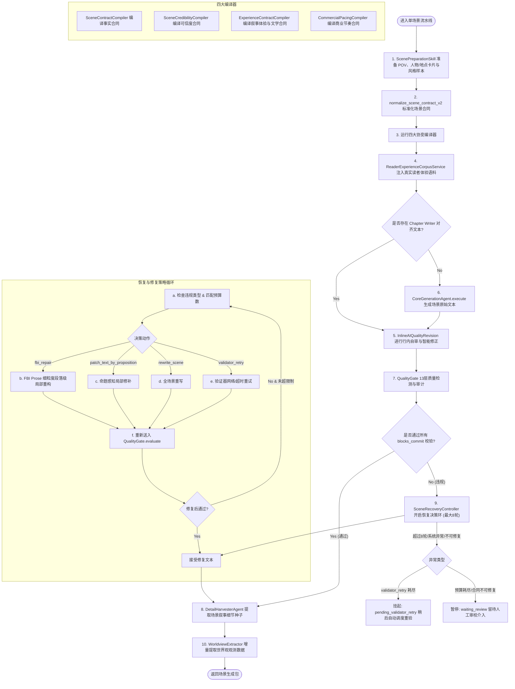

# 万象谱 AI 小说引擎工作流流程图

本文件保存了系统中两个核心工作流的 Mermaid 格式流程图。你可以将其复制到任何支持 Mermaid 渲染的工具（如 Notion、Mermaid Live Editor 等）中查看或导出为 PNG/SVG 图片。

---

## 1. 宏观章节生成工作流 (Macro Chapter Workflow)

```mermaid
graph TD
    Start([开始生成章节]) --> ProjectLock[1. 获取 ProjectLock 锁]
    ProjectLock --> Checkpoint[2. StateManager.create_checkpoint 创建回滚快照]
    Checkpoint --> LoadContract[3. 加载基线 ChapterBaseline & 规划合同 ChapterPlanContract]
    
    LoadContract --> EICPlanning[4. EIC 规划阶段: EditorInChiefAgent.execute]
    EICPlanning --> OutlineCompile[5. GenerationOutlineAdapter.compile_chapter 编译章节大纲与场景包]
    
    OutlineCompile --> Normalizer[6. V2 编译管线: Normalizer 归一化为 ContractItem]
    Normalizer --> Allocation[7. SceneAllocationCompiler 分配场景与字数预算]
    Allocation --> Budget[8. InformationBudgetCompiler 进行信息预算限制]
    Budget --> WriterInput[9. WriterInputCompiler 编译生成 WriterInputPacket]
    
    WriterInput --> DecidePath{是否启用 Chapter Writer?}
    DecidePath -- Yes (无人工覆盖 & 无跳过规划) --> BuildEnvelope[10. ContextEnvelopeBuilder 组装上下文 Token 预算与压实]
    BuildEnvelope --> CoreGenChapter[11. CoreGenerationAgent 一次性生成整章草稿]
    CoreGenChapter -- 成功 --> Alignment[12. SceneSpanAligner 将草稿按对齐算法拆分为场景文本]
    
    CoreGenChapter -- 异常/空正文 --> Fallback[13. 降级标志: use_chapter_writer = False]
    Alignment -- 失败/对齐场景数不匹配 --> Fallback
    
    DecidePath -- No (存在人工覆盖/已调过规划) --> Fallback
    Fallback --> LoopScenes[14. 遍历场景包: 执行场景流水线]
    Alignment -- 成功 --> LoopScenes
    
    LoopScenes --> ScenePipeline[15. 运行 _run_scene_pipeline (微观流)]
    ScenePipeline --> SceneDone{所有场景已处理?}
    SceneDone -- No --> LoopScenes
    SceneDone -- Yes --> FactExtract[16. extract_chapter_facts 聚合提取章节事实与状态更新]
    
    FactExtract --> StylePolish[17. StylePolishSkill 读取记忆服务, 进行风格润色与去杂质]
    StylePolish --> TwoPhaseCommit[18. 双阶段提交: Chapter.status = committing & 削减冲突投影]
    TwoPhaseCommit --> ApplyEffects[19. apply_pending_chapter_effects 应用状态卡片 & 写入数据库]
    ApplyEffects --> EventBus[20. CrossSystemEventBus 发布 CHAPTER_GENERATED.v1 事件]
    EventBus --> Unlock[21. 释放项目锁 & 生成章节摘要]
    Unlock --> End([生成结束])
```

---

## 2. 微观单场景流水线与恢复机制 (Micro Scene Pipeline & Recovery Loop)


